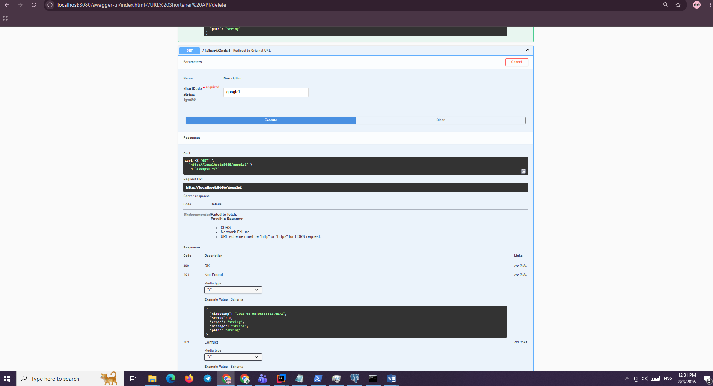

# AI Usage Traceability

## Objective

This document records how AI was used throughout the project while maintaining engineering ownership.

---

# AI Usage Log

| Phase | AI Assistance | Engineer Decision |
|--------|---------------|------------------|
| Requirement Analysis | Summarized requirements | Reviewed and refined |
| Architecture | Generated alternatives | Selected layered architecture |
| Entity Design | Generated entity skeleton | Added optimistic locking and auditing |
| DTO Design | Generated initial DTOs | Simplified and validated |
| Service Layer | Draft implementation | Refactored business logic |
| Controller | Generated REST endpoints | Added HTTP status handling |
| Testing | Generated unit tests | Improved assertions and coverage |
| Documentation | Drafted documents | Reviewed and finalized |

---

# Prompt Engineering Strategy

Each prompt included:

- Objective
- Constraints
- Acceptance Criteria
- Technical Context

Example:

Objective:
Implement URL shortening.

Constraints:

- Spring Boot
- PostgreSQL
- SecureRandom
- Layered Architecture
- Production Quality

Acceptance Criteria:

- Unique short code
- Validation
- Unit tests
- Clean code

---

# AI Outputs

The following AI outputs were accepted.

- DTO classes
- Test skeletons
- Documentation drafts

The following outputs were modified.

- Validation logic
- Repository queries
- Exception handling
- Service implementation
- Architecture decisions

The following outputs were rejected.

- Direct entity exposure
- Missing validation
- Weak exception handling
- Tight coupling

---

# Security Controls

Sensitive information was never provided to AI.

No credentials were shared.

No production data was uploaded.

No proprietary Schwab information was used.

---

# Engineering Ownership

All commits, testing, architecture decisions, validation, and production readiness checks remained under engineer control.

AI functioned as a productivity accelerator rather than an autonomous developer.

| ID     | Task                   | AI Action               | Output               | Engineer Action                    | Decision          | Validation            | Artifact    |
| ------ | ---------------------- | ----------------------- | -------------------- | ---------------------------------- | ----------------- | --------------------- | ----------- |
| AI-001 | Requirement analysis   | Analyze requirements    | Requirement draft    | Reviewed/normalized                | Accepted          | Requirement checklist | docs/01     |
| AI-002 | Architecture           | Propose architectures   | Layered architecture | Compared alternatives              | Accepted          | Architecture review   | docs/03     |
| AI-003 | Service implementation | Generate implementation | Service draft        | Modified validation/error handling | Edited            | Unit tests            | ServiceImpl |
| AI-004 | Tests                  | Generate test cases     | JUnit tests          | Added negative/edge cases          | Edited            | 19 tests              | ServiceTest |
| AI-005 | Code review            | Review implementation   | Findings             | Applied selected findings          | Accepted/Rejected | Build + tests         | Code        |
| AI-006 | Documentation          | Draft assessment docs   | Documentation        | Reviewed/updated                   | Edited            | Document review       | docs        |

| Task              | AI action                        | Outcome  | Engineer decision                                                | Validation                  |
| ----------------- | -------------------------------- | -------- | ---------------------------------------------------------------- | --------------------------- |
| Controller        | Generated initial implementation | Edited   | Accepted after review                                            | Tests                       |
| Exception handler | Suggested DB failure handling    | Edited   | Added `CannotCreateTransactionException` handling                | PostgreSQL-down test        |
| Test coverage     | Generated test cases             | Edited   | Removed redundant tests                                          | Coverage + tests            |
| Docker            | Suggested containerization       | Rejected | Local environment couldn't support Docker; documented limitation | PostgreSQL local validation |
| MapStruct         | Suggested/implemented            | Rejected | Removed to keep solution simpler                                 | Build/tests                 |
